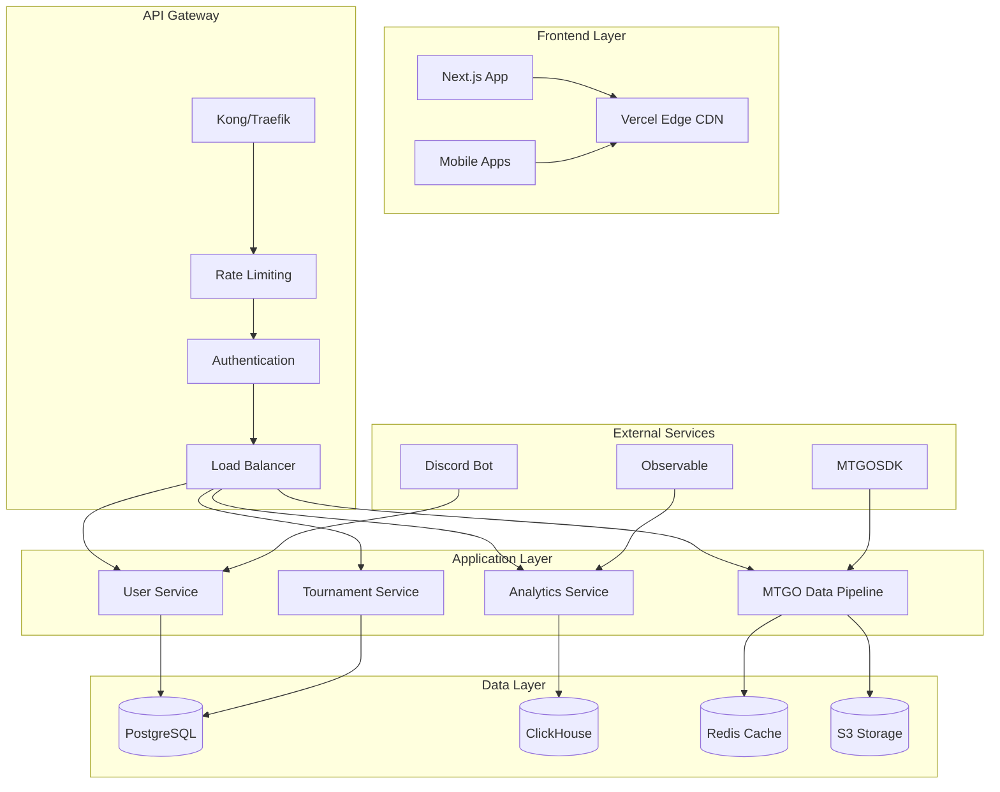

# MTGTools Infrastructure Audit Report

*Generated: August 5, 2025*  
*Lead DevOps Engineer: Claude Code*  
*For: Guillaume Bordes, Founder & Visionary Leader*

## Executive Summary

MTGTools currently operates as a GitHub Pages static site with external Videre Project infrastructure. To scale from 100 to 10,000+ concurrent users, we need a complete infrastructure transformation focusing on:

- **API-First Architecture**: Real-time MTGO data processing
- **Multi-Region Deployment**: Global latency <100ms
- **Serverless-First Design**: Cost-effective auto-scaling
- **Zero-Downtime Deployments**: Professional-grade reliability
- **Comprehensive Monitoring**: Full observability stack

**Current State: Hobby Project → Target State: Enterprise Platform**

---

## 1. CURRENT INFRASTRUCTURE AUDIT

### 1.1 Web Frontend Analysis

**Current Setup:**
```yaml
Platform: GitHub Pages
Deployment: GitHub Actions (deploy-pages.yml)
Domain: mtgtools.github.io/MTGTools
Assets: Static HTML/CSS/JS
Build Process: Jekyll + HTML minification
CDN: GitHub's CDN (limited)
```

**Performance Assessment:**
- ✅ **Fast initial load**: Static assets serve quickly
- ✅ **Version control**: Full git history
- ✅ **Automated deployment**: Push-to-deploy workflow
- ❌ **No custom domain**: Branding limitation
- ❌ **Limited CDN**: No global edge caching
- ❌ **No A/B testing**: Missing growth optimization
- ❌ **No analytics**: Blind to user behavior

### 1.2 Backend Infrastructure Gap Analysis

**Current State:**
```
❌ No MTGTools backend deployed
❌ No database infrastructure
❌ No API documentation
❌ No real-time data pipeline
❌ No user authentication
❌ No rate limiting
```

**Videre Project External Dependencies:**
```yaml
MTGOSDK: 
  - Platform: Windows .NET applications
  - Distribution: GitHub releases
  - Deployment: Manual user installation
  
API Layer:
  - Platform: Cloudflare Workers
  - Scalability: Edge computing
  - Documentation: Missing
  - Monitoring: Unknown
```

### 1.3 Critical Infrastructure Gaps

**Scalability Blockers:**
1. **No Backend Services**: Can't handle user accounts, preferences, tournaments
2. **No Database Layer**: No persistent data storage
3. **No Real-time Processing**: MTGO data pipeline missing
4. **No Authentication**: Can't secure premium features
5. **No Monitoring**: Blind to performance and errors

**Security Vulnerabilities:**
1. **No HTTPS enforcement**: Mixed content risks
2. **No CSP headers**: XSS vulnerability
3. **No rate limiting**: DoS vulnerability
4. **No input validation**: Injection risks
5. **No GDPR compliance**: EU legal risk

**Operational Risks:**
1. **Single points of failure**: GitHub dependency
2. **No disaster recovery**: No backup strategy
3. **No incident response**: No alerting system
4. **No capacity planning**: No growth metrics
5. **No cost optimization**: Resource waste potential

---

## 2. SCALABLE ARCHITECTURE DESIGN

### 2.1 Target Architecture Overview



### 2.2 Technology Stack Selection

**Frontend Stack:**
```yaml
Framework: Next.js 14 (React + TypeScript)
Deployment: Vercel (Edge CDN + Serverless)
Styling: Tailwind CSS (existing design system)
State: Zustand + React Query
Testing: Vitest + Playwright
```

**Backend Stack:**
```yaml
Runtime: Node.js 20 (TypeScript)
Framework: Fastify (high performance)
Database: PostgreSQL 16 (primary) + Redis 7 (cache)
API: GraphQL + REST hybrid
Auth: Auth0 / Supabase Auth
Deployment: Docker + Kubernetes
```

**Infrastructure Stack:**
```yaml
Cloud Provider: AWS (multi-region)
Container Orchestration: EKS (Kubernetes)
Service Mesh: Istio (traffic management)
API Gateway: Kong (rate limiting + monitoring)
Monitoring: Prometheus + Grafana + Jaeger
CI/CD: GitHub Actions + ArgoCD
```

### 2.3 Multi-Region Deployment Strategy

**Primary Regions:**
```yaml
North America: us-east-1 (Virginia)
Europe: eu-west-1 (Ireland)  
Asia Pacific: ap-southeast-1 (Singapore)
```

**Traffic Routing:**
```yaml
DNS: Route 53 with geolocation routing
CDN: CloudFront with custom origins
Database: Primary-replica with read routing
Cache: Redis clusters per region
```

---

## 3. CI/CD PIPELINE BLUEPRINT

### 3.1 GitHub Actions Workflow Architecture

**Pipeline Stages:**
```yaml
Stage 1: Code Quality
  - ESLint + Prettier
  - TypeScript compilation
  - Unit tests (Vitest)
  - Security scanning (Snyk)
  
Stage 2: Build & Test
  - Docker image builds
  - Integration tests
  - E2E tests (Playwright)
  - Performance benchmarks
  
Stage 3: Deploy
  - Staging deployment
  - Smoke tests
  - Production deployment
  - Health checks
```

**Multi-Environment Strategy:**
```yaml
Development:
  - Branch: develop
  - Auto-deploy on push
  - Shared resources
  
Staging:
  - Branch: main (after PR merge)
  - Production-like environment
  - Full test suite
  
Production:
  - Manual approval required
  - Blue-green deployment
  - Automated rollback
```

### 3.2 GitOps with ArgoCD

**Repository Structure:**
```
mtgtools-infrastructure/
├── applications/
│   ├── frontend/
│   ├── api-gateway/
│   ├── user-service/
│   └── mtgo-pipeline/
├── environments/
│   ├── development/
│   ├── staging/
│   └── production/
└── shared/
    ├── monitoring/
    ├── security/
    └── networking/
```

---

## 4. MONITORING & OBSERVABILITY STRATEGY

### 4.1 Three Pillars of Observability

**Metrics (Prometheus):**
```yaml
Application Metrics:
  - Request latency (p95, p99)
  - Error rates by endpoint
  - Throughput (RPS)
  - Active users
  
Infrastructure Metrics:
  - CPU/Memory utilization
  - Disk I/O and space
  - Network throughput
  - Database connections
```

**Logs (ELK Stack):**
```yaml
Centralized Logging:
  - Application logs (JSON structured)
  - Access logs (nginx format)
  - Security logs (auth events)
  - Audit logs (data changes)
  
Log Aggregation:
  - Elasticsearch cluster
  - Logstash processing
  - Kibana dashboards
```

**Traces (Jaeger):**
```yaml
Distributed Tracing:
  - API request flows
  - Database query tracing
  - External service calls
  - Performance bottlenecks
```

### 4.2 Alerting Strategy

**Critical Alerts (PagerDuty):**
```yaml
P1 - Immediate Response:
  - API downtime >2 minutes
  - Error rate >5%
  - Database connection failures
  
P2 - Response within 30min:
  - High latency (p95 >500ms)
  - Memory usage >80%
  - Disk space >85%
```

---

## 5. COST ANALYSIS & OPTIMIZATION

### 5.1 Growth Stage Cost Projections

**Stage 1: Foundation (0-100 users)**
```yaml
Monthly Cost: $150-300
Infrastructure:
  - Vercel Pro: $20/month
  - AWS EKS: $73/month
  - RDS PostgreSQL: $25/month
  - Monitoring stack: $50/month
```

**Stage 2: Growth (100-1,000 users)**
```yaml
Monthly Cost: $500-800
Scaling factors:
  - Additional app replicas
  - Read replicas for database
  - Enhanced monitoring
  - Multi-region deployment
```

**Stage 3: Scale (1,000-10,000 users)**
```yaml
Monthly Cost: $2,000-4,000
Optimizations:
  - Reserved instances (30% savings)
  - Spot instances for batch jobs
  - CDN caching optimization
  - Database query optimization
```

### 5.2 Cost Optimization Strategies

**Infrastructure Optimization:**
```yaml
Compute:
  - Right-sizing based on metrics
  - Auto-scaling policies
  - Spot instances for dev/test
  
Storage:
  - S3 Intelligent Tiering
  - Database query optimization
  - CDN cache hit ratio >90%
  
Networking:
  - Regional traffic optimization
  - Data transfer minimization
  - Compression enabled
```

---

## 6. SECURITY & COMPLIANCE FRAMEWORK

### 6.1 Security Controls

**Network Security:**
```yaml
Infrastructure:
  - VPC with private subnets
  - Security groups (least privilege)
  - WAF with DDoS protection
  - TLS 1.3 everywhere
  
Application:
  - OWASP Top 10 mitigations
  - Input validation & sanitization
  - SQL injection prevention
  - XSS protection headers
```

**Identity & Access Management:**
```yaml
Authentication:
  - OAuth 2.0 + OpenID Connect
  - Multi-factor authentication
  - Session management
  - Password policies
  
Authorization:
  - Role-based access control (RBAC)
  - API key management
  - Service-to-service auth (mTLS)
```

### 6.2 GDPR Compliance

**Data Protection:**
```yaml
Data Minimization:
  - Collect only necessary data
  - Automated data retention policies
  - Right to erasure implementation
  
Consent Management:
  - Cookie consent banners
  - Granular privacy controls
  - Audit trail for consent
```

---

## 7. IMPLEMENTATION ROADMAP

### 7.1 Phase 1: Foundation (Weeks 1-4)

**Week 1-2: Infrastructure Bootstrap**
```yaml
Tasks:
  - Setup AWS organization & accounts
  - Create VPC & networking
  - Deploy EKS cluster
  - Setup monitoring foundation
  
Deliverables:
  - Basic Kubernetes cluster
  - Prometheus + Grafana
  - CI/CD pipeline skeleton
```

**Week 3-4: Core Services**
```yaml
Tasks:
  - Deploy PostgreSQL RDS
  - Create user authentication service
  - Setup API gateway (Kong)
  - Implement basic frontend migration
  
Deliverables:
  - User registration/login
  - Database migrations
  - API documentation framework
```

### 7.2 Phase 2: API & Real-time (Weeks 5-8)

**Week 5-6: MTGO Data Pipeline**
```yaml
Tasks:
  - Design real-time data architecture
  - Implement MTGOSDK integration
  - Create tournament tracking API
  - Setup Redis caching layer
  
Deliverables:
  - Live MTGO data ingestion
  - Tournament API endpoints
  - Caching strategy implementation
```

**Week 7-8: Advanced Features**
```yaml
Tasks:
  - Implement user preferences
  - Create analytics dashboard
  - Setup A/B testing framework
  - Add payment processing
  
Deliverables:
  - User dashboard
  - Analytics collection
  - Premium features foundation
```

### 7.3 Phase 3: Scale & Optimize (Weeks 9-12)

**Week 9-10: Multi-Region Deployment**
```yaml
Tasks:
  - Deploy to EU region
  - Setup global load balancing
  - Implement CDN optimization
  - Add performance monitoring
  
Deliverables:
  - Global deployment
  - <100ms latency worldwide
  - Performance dashboards
```

**Week 11-12: Production Hardening**
```yaml
Tasks:
  - Security audit & penetration testing
  - Disaster recovery testing
  - Performance optimization
  - Documentation completion
  
Deliverables:
  - Security certification
  - Runbook documentation
  - Performance benchmarks
```

---

## 8. RISK MITIGATION STRATEGIES

### 8.1 Technical Risks

**High-Priority Risks:**
```yaml
MTGO API Changes:
  Mitigation: Version detection + rapid response team
  
Database Performance:
  Mitigation: Read replicas + query optimization
  
Traffic Spikes:
  Mitigation: Auto-scaling + CDN caching
  
Security Breaches:
  Mitigation: Defense in depth + incident response
```

### 8.2 Operational Risks

**Business Continuity:**
```yaml
Vendor Lock-in:
  Mitigation: Multi-cloud strategy + containerization
  
Key Personnel:
  Mitigation: Documentation + knowledge sharing
  
Compliance:
  Mitigation: Regular audits + automated checks
```

---

## 9. SUCCESS METRICS & KPIs

### 9.1 Technical KPIs

```yaml
Performance:
  - API response time: <100ms (p95)
  - Uptime: >99.9%
  - Error rate: <0.1%
  
Scalability:
  - Concurrent users: 10,000+
  - Requests per second: 1,000+
  - Data processing: Real-time (<1s latency)
  
Reliability:
  - MTBF: >720 hours
  - Recovery time: <5 minutes
  - Data consistency: 100%
```

### 9.2 Business KPIs

```yaml
Growth:
  - Monthly active users growth
  - API adoption rate
  - Third-party integrations
  
Efficiency:
  - Infrastructure cost per user
  - Development velocity
  - Time to market for features
```

---

## 10. CONCLUSION & NEXT STEPS

### 10.1 Critical Success Factors

1. **API-First Design**: Enable ecosystem growth from day 1
2. **Observability**: Monitor everything, optimize continuously
3. **Security by Design**: Build trust through transparency
4. **Cost Optimization**: Sustainable growth economics
5. **Developer Experience**: Attract and retain contributors

### 10.2 Immediate Actions Required

**This Week:**
1. Setup AWS organization and billing
2. Create infrastructure repository
3. Begin VPC and networking setup
4. Order custom domain (mtgtools.com)

**Next Week:**
1. Deploy first Kubernetes cluster
2. Setup monitoring foundation
3. Begin API service development
4. Create deployment pipeline

### 10.3 Investment Justification

**Technical Debt Elimination:**
- Current: Manual deployments, no monitoring, security gaps
- Future: Automated, observable, secure platform

**Scalability Investment:**
- Current: Can't handle growth beyond static site
- Future: Auto-scale from 1 to 10,000+ users

**Developer Productivity:**
- Current: High friction for contributors
- Future: Self-service development environment

**Business Enablement:**
- Current: Limited to static content
- Future: Full platform for competitive Magic tools

---

**This infrastructure transformation positions MTGTools as the definitive platform for competitive Magic: The Gathering tools, capable of scaling from hundreds to tens of thousands of users while maintaining professional-grade reliability and performance.**

*Next Document: [SCALABLE_ARCHITECTURE_DESIGN.md](./SCALABLE_ARCHITECTURE_DESIGN.md)*