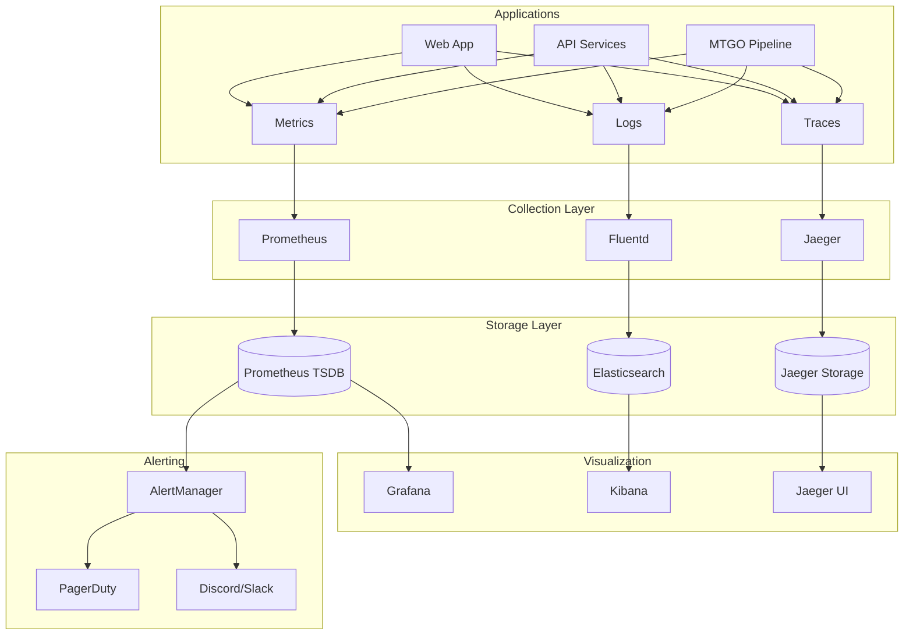

# MTGTools Monitoring & Observability Strategy

*Generated: August 5, 2025*  
*DevOps Engineer: Claude Code*  
*For: Guillaume Bordes & MTGTools Operations Team*

## Executive Summary

This strategy establishes comprehensive monitoring and observability for MTGTools, enabling proactive issue detection, performance optimization, and data-driven decisions as we scale from 100 to 10,000+ users.

**Key Principles:**
- **Observability-First**: Instrument everything from day one
- **Proactive Alerting**: Detect issues before users notice
- **Business Metrics**: Connect technical metrics to business outcomes
- **Cost-Conscious**: Efficient monitoring that scales with usage

---

## 1. OBSERVABILITY ARCHITECTURE

### 1.1 Three Pillars Implementation



### 1.2 Technology Stack

**Metrics Collection:**
```yaml
Prometheus:
  - Time-series database
  - Pull-based metrics collection
  - Service discovery integration
  - High availability setup

Instrumentation:
  - Node.js: prom-client library
  - Go: prometheus/client_golang
  - Custom metrics via HTTP endpoints
```

**Log Aggregation:**
```yaml
EFK Stack:
  - Elasticsearch: Log storage and search
  - Fluentd: Log collection and parsing
  - Kibana: Log visualization and analysis

Structured Logging:
  - JSON format for all applications
  - Correlation IDs for request tracing
  - Contextual metadata inclusion
```

**Distributed Tracing:**
```yaml
Jaeger:
  - End-to-end request tracing
  - Performance bottleneck identification
  - Service dependency mapping
  - OpenTelemetry integration
```

---

## 2. METRICS STRATEGY

### 2.1 Golden Signals (SLIs)

**Latency Metrics:**
```yaml
API Response Time:
  - Metric: http_request_duration_seconds
  - Labels: [method, endpoint, status_code]
  - Percentiles: p50, p95, p99
  - SLO: p95 < 100ms, p99 < 500ms

Database Query Time:
  - Metric: db_query_duration_seconds
  - Labels: [query_type, table]
  - SLO: p95 < 50ms

MTGO Data Processing:
  - Metric: mtgo_processing_duration_seconds
  - Labels: [event_type, source]
  - SLO: p95 < 1s
```

**Traffic Metrics:**
```yaml
Request Rate:
  - Metric: http_requests_total
  - Labels: [method, endpoint, status_code]
  - Rate: requests per second

User Activity:
  - Metric: active_users_total
  - Labels: [user_type, region]
  - Gauge: concurrent users

Data Ingestion:
  - Metric: mtgo_events_processed_total
  - Labels: [event_type, status]
  - Counter: events per second
```

**Error Metrics:**
```yaml
HTTP Errors:
  - Metric: http_requests_total{status_code="5xx"}
  - SLO: Error rate < 0.1%

Application Errors:
  - Metric: application_errors_total
  - Labels: [service, error_type, severity]
  - Alert: Any critical errors

External Service Errors:
  - Metric: external_service_errors_total
  - Labels: [service_name, error_type]
  - SLO: < 1% error rate
```

**Saturation Metrics:**
```yaml
Resource Utilization:
  - CPU: node_cpu_usage_percent
  - Memory: node_memory_usage_percent
  - Disk: node_disk_usage_percent
  - Network: node_network_bytes_total

Application Saturation:
  - Database connections: db_connections_active
  - Queue depth: job_queue_depth
  - Cache hit ratio: cache_hit_ratio
```

### 2.2 Business Metrics

**User Engagement:**
```yaml
User Metrics:
  - Daily Active Users (DAU)
  - Monthly Active Users (MAU)
  - User retention rates
  - Feature adoption rates

Tournament Metrics:
  - Tournaments tracked per day
  - Games analyzed per hour
  - Archetype detection accuracy
  - Data freshness (time to ingest)
```

**Platform Health:**
```yaml
API Usage:
  - API calls per endpoint
  - Authentication success rate
  - Rate limiting hits
  - Third-party integrations

Performance:
  - Page load times
  - Search response times
  - Data visualization render times
  - Mobile app performance
```

---

## 3. LOGGING STRATEGY

### 3.1 Structured Logging Format

**Standard Log Format:**
```json
{
  "timestamp": "2025-08-05T10:30:00Z",
  "level": "info",
  "service": "api-service",
  "version": "1.2.3",
  "correlation_id": "req_123abc",
  "user_id": "user_456def",
  "message": "Tournament data processed",
  "context": {
    "tournament_id": "tourney_789",
    "processing_time_ms": 245,
    "events_processed": 150
  },
  "metadata": {
    "pod_name": "api-service-5f7b8c9d-xyz",
    "region": "us-east-1"
  }
}
```

**Log Levels:**
```yaml
ERROR:
  - Application errors requiring immediate attention
  - External service failures
  - Data corruption or loss

WARN:
  - Recoverable errors
  - Performance degradation
  - Configuration issues

INFO:
  - Business events (user actions, data processing)
  - External API calls
  - System lifecycle events

DEBUG:
  - Detailed execution flow
  - Variable values
  - Performance timings
```

### 3.2 Log Retention & Storage

**Retention Policy:**
```yaml
Production Logs:
  - ERROR/WARN: 90 days (hot storage) + 1 year (cold storage)
  - INFO: 30 days (hot storage) + 90 days (cold storage)
  - DEBUG: 7 days (hot storage only)

Audit Logs:
  - All levels: 7 years (compliance requirement)
  - Encrypted at rest
  - Immutable storage

Security Logs:
  - Authentication events: 2 years
  - Authorization failures: 2 years
  - Admin actions: 7 years
```

---

## 4. ALERTING & INCIDENT RESPONSE

### 4.1 Alert Hierarchy

**P1 - Critical (PagerDuty)**
```yaml
Triggers:
  - API downtime > 2 minutes
  - Error rate > 5% for 5 minutes
  - Database unavailable
  - Data processing stopped > 10 minutes

Response Time: Immediate (5 minutes)
Escalation: Auto-escalate after 15 minutes
Notifications: Phone, SMS, PagerDuty app
```

**P2 - High (Slack/Discord)**
```yaml
Triggers:
  - High latency (p95 > 500ms for 10 minutes)
  - Memory usage > 85% for 15 minutes
  - External service degradation
  - Unusual traffic patterns

Response Time: 30 minutes
Notifications: Slack channel, Discord webhook
```

**P3 - Medium (Email)**
```yaml
Triggers:
  - Disk space > 80%
  - Cache hit ratio < 90%
  - SSL certificate expiring < 30 days
  - Batch job failures

Response Time: 4 hours
Notifications: Email to ops team
```

### 4.2 Alert Rules Configuration

**Prometheus Alert Rules:**
```yaml
# High API error rate
- alert: HighErrorRate
  expr: |
    (
      rate(http_requests_total{status_code=~"5.."}[5m]) /
      rate(http_requests_total[5m])
    ) > 0.05
  for: 5m
  labels:
    severity: critical
    service: "{{ $labels.service }}"
  annotations:
    summary: "High error rate detected"
    description: |
      Error rate is {{ $value | humanizePercentage }} on {{ $labels.service }}
      Runbook: https://wiki.mtgtools.com/runbooks/high-error-rate

# API latency SLO violation
- alert: HighLatency
  expr: |
    histogram_quantile(0.95, 
      rate(http_request_duration_seconds_bucket[5m])
    ) > 0.1
  for: 10m
  labels:
    severity: warning
    service: "{{ $labels.service }}"
  annotations:
    summary: "API latency SLO violation"
    description: |
      95th percentile latency is {{ $value }}s on {{ $labels.service }}

# Database connection issues
- alert: DatabaseConnectionFailure
  expr: up{job="postgresql"} == 0
  for: 2m
  labels:
    severity: critical
  annotations:
    summary: "Database is down"
    description: "PostgreSQL database is not responding"
    runbook_url: "https://wiki.mtgtools.com/runbooks/database-down"

# MTGO data pipeline health
- alert: MTGODataPipelineStalled
  expr: |
    increase(mtgo_events_processed_total[10m]) == 0
  for: 10m
  labels:
    severity: critical
    component: "mtgo-pipeline"
  annotations:
    summary: "MTGO data pipeline has stopped processing"
    description: "No MTGO events processed in the last 10 minutes"
```

---

## 5. DASHBOARDS & VISUALIZATION

### 5.1 Grafana Dashboard Hierarchy

**Executive Dashboard:**
```yaml
Metrics:
  - Overall system health (uptime, error rates)
  - User growth (DAU, MAU, new registrations)
  - Business KPIs (tournaments tracked, API usage)
  - Cost metrics (infrastructure spend per user)

Audience: Leadership team, product managers
Update Frequency: Real-time
Time Range: Last 30 days with drill-down
```

**Operations Dashboard:**
```yaml
Metrics:
  - Service health (all microservices)
  - Infrastructure metrics (CPU, memory, disk)
  - Database performance (connections, query time)
  - Alert status and recent incidents

Audience: DevOps team, on-call engineers
Update Frequency: Real-time
Time Range: Last 24 hours
```

**Development Dashboard:**
```yaml
Metrics:
  - API endpoint performance by version
  - Feature flag usage and performance impact
  - Code deployment metrics
  - Test coverage and quality metrics

Audience: Development team
Update Frequency: Real-time
Time Range: Last 7 days
```

**Business Intelligence Dashboard:**
```yaml
Metrics:
  - User behavior analytics
  - Tournament meta-game trends
  - Geographic usage patterns
  - Revenue attribution (if applicable)

Audience: Product team, Guillaume
Update Frequency: Hourly
Time Range: Configurable (daily to yearly views)
```

### 5.2 Custom Dashboard Examples

**MTGO Data Pipeline Dashboard:**
```yaml
Panels:
  1. Events Processed Per Hour (time series)
  2. Processing Latency by Event Type (heatmap)
  3. Pipeline Health Status (stat panel)
  4. Data Quality Metrics (gauge)
  5. Error Rate by Stage (bar chart)
  6. Queue Depth Over Time (graph)
  7. Top Processing Errors (table)
  8. Throughput Comparison (week over week)

Filters:
  - Time range picker
  - Event type selector
  - Environment selector (staging/production)
```

**API Performance Dashboard:**
```yaml
Panels:
  1. Request Rate (RPS) by Endpoint
  2. Response Time Percentiles (p50, p95, p99)
  3. Error Rate by Status Code
  4. Top Slowest Endpoints
  5. Geographic Request Distribution
  6. Authentication Success Rate
  7. Rate Limiting Hits
  8. Cache Hit Ratio

Alerts:
  - SLO violations highlighted in red
  - Trend arrows for week-over-week changes
```

---

## 6. DISTRIBUTED TRACING

### 6.1 Tracing Implementation

**Service Instrumentation:**
```typescript
// Example: Node.js API service tracing
import { trace } from '@opentelemetry/api';
import { NodeSDK } from '@opentelemetry/sdk-node';
import { JaegerExporter } from '@opentelemetry/exporter-jaeger';

const sdk = new NodeSDK({
  traceExporter: new JaegerExporter({
    endpoint: process.env.JAEGER_ENDPOINT,
  }),
  serviceName: 'api-service',
  serviceVersion: process.env.SERVICE_VERSION,
});

// Trace database operations
const tracer = trace.getTracer('database');

export async function getUserTournaments(userId: string) {
  const span = tracer.startSpan('get_user_tournaments');
  span.setAttributes({
    'user.id': userId,
    'db.operation': 'select',
    'db.table': 'tournaments',
  });
  
  try {
    const tournaments = await db.query(
      'SELECT * FROM tournaments WHERE user_id = $1',
      [userId]
    );
    
    span.setAttributes({
      'db.rows_affected': tournaments.length,
    });
    
    return tournaments;
  } catch (error) {
    span.recordException(error);
    span.setStatus({ code: SpanStatusCode.ERROR });
    throw error;
  } finally {
    span.end();
  }
}
```

**Trace Context Propagation:**
```yaml
HTTP Headers:
  - traceparent: Version-TraceId-SpanId-Flags
  - tracestate: Vendor-specific trace data

Intra-Service Calls:
  - Propagate context through all async operations
  - Include in database queries
  - Pass to external service calls

Log Correlation:
  - Include trace ID in all log entries
  - Enable trace-to-logs navigation in Grafana
```

### 6.2 Trace Analysis

**Performance Optimization:**
```yaml
Identify Bottlenecks:
  - Find slowest spans in critical paths
  - Analyze database query performance
  - Detect N+1 query problems
  - Optimize external service calls

Error Analysis:
  - Trace error propagation paths
  - Identify root cause of failures
  - Analyze retry behavior
  - Debug intermittent issues
```

---

## 7. CAPACITY PLANNING

### 7.1 Growth Forecasting

**Metric-Based Forecasting:**
```yaml
User Growth Models:
  - Linear growth: Current trend extrapolation
  - Exponential growth: Viral adoption scenarios
  - Seasonal patterns: Tournament calendar correlation

Resource Scaling:
  - CPU/Memory per concurrent user
  - Database connections per active user
  - Storage growth per tournament
  - Network bandwidth per API call
```

**Predictive Alerts:**
```yaml
Capacity Warnings:
  - 70% resource utilization: Plan scaling
  - 85% resource utilization: Execute scaling
  - Storage growth rate > 10GB/day: Review retention
  - Database connection pool > 80%: Scale horizontally
```

### 7.2 Auto-Scaling Configuration

**Kubernetes HPA:**
```yaml
apiVersion: autoscaling/v2
kind: HorizontalPodAutoscaler
metadata:
  name: api-service-hpa
spec:
  scaleTargetRef:
    apiVersion: apps/v1
    kind: Deployment
    name: api-service
  minReplicas: 3
  maxReplicas: 50
  metrics:
  - type: Resource
    resource:
      name: cpu
      target:
        type: Utilization
        averageUtilization: 70
  - type: Resource
    resource:
      name: memory
      target:
        type: Utilization
        averageUtilization: 80
  - type: Object
    object:
      metric:
        name: http_requests_per_second
      target:
        type: AverageValue
        averageValue: "100"
  behavior:
    scaleUp:
      stabilizationWindowSeconds: 60
      policies:
      - type: Percent
        value: 50
        periodSeconds: 60
    scaleDown:
      stabilizationWindowSeconds: 300
      policies:
      - type: Percent
        value: 10
        periodSeconds: 60
```

---

## 8. COST OPTIMIZATION

### 8.1 Monitoring Cost Analysis

**Cost by Component:**
```yaml
Prometheus:
  - Storage: $0.10/GB/month (retention-based)
  - Compute: $50-200/month (depending on scale)
  - High availability: +50% cost

Elasticsearch:
  - Storage: $0.12/GB/month
  - Compute: $100-500/month
  - Index management optimization saves 30%

Jaeger:
  - Storage: $0.08/GB/month (compressed traces)
  - Compute: $30-100/month
  - Sampling reduces costs by 90%

Grafana:
  - Managed service: $50-200/month
  - Self-hosted: $20-50/month compute
```

**Optimization Strategies:**
```yaml
Metrics Optimization:
  - Reduce metric cardinality
  - Implement recording rules
  - Use appropriate retention periods
  - Sample high-frequency metrics

Log Optimization:
  - Structured logging reduces parsing costs
  - Log level filtering in production
  - Compress logs before shipping
  - Use log sampling for high-volume services

Trace Optimization:
  - Head-based sampling (1-10% of traces)
  - Tail-based sampling for error traces
  - Remove noisy, low-value spans
```

### 8.2 ROI Calculation

**Monitoring Investment vs. Downtime Cost:**
```yaml
Monitoring Investment:
  - Setup cost: $5,000 (one-time)
  - Monthly operational cost: $500-2,000
  - Team training cost: $2,000 (one-time)

Downtime Prevention Value:
  - Average incident cost: $10,000/hour
  - Incidents prevented per month: 2-5
  - Early detection value: $50,000-100,000/month

ROI: 20:1 to 50:1 return on monitoring investment
```

---

## 9. SECURITY MONITORING

### 9.1 Security Metrics

**Authentication & Authorization:**
```yaml
Login Metrics:
  - Failed login attempts per IP
  - Brute force attack detection
  - Unusual login locations
  - Multi-factor authentication bypass attempts

API Security:
  - Invalid API key usage
  - Rate limiting violations
  - Suspicious request patterns
  - Data exfiltration attempts
```

**Infrastructure Security:**
```yaml
Network Security:
  - Unusual network traffic patterns
  - Port scanning attempts
  - DDoS attack detection
  - Firewall rule violations

Container Security:
  - Container runtime anomalies
  - Privilege escalation attempts
  - Unauthorized image deployments
  - Resource limit breaches
```

### 9.2 Security Alerting

**Real-time Security Alerts:**
```yaml
Critical Security Events:
  - Multiple failed logins from same IP
  - Admin privilege escalation
  - Unusual data access patterns
  - Security scan detection

Response Actions:
  - Automatic IP blocking
  - Account lockout procedures
  - Security team notification
  - Incident response activation
```

---

## 10. IMPLEMENTATION ROADMAP

### 10.1 Phase 1: Foundation (Weeks 1-2)

**Week 1: Basic Monitoring**
```yaml
Tasks:
  - Deploy Prometheus in Kubernetes
  - Setup basic Grafana dashboards
  - Implement application metrics
  - Configure basic alerting

Deliverables:
  - Golden signals monitoring
  - Basic alerting to Slack
  - Infrastructure metrics collection
```

**Week 2: Logging & Observability**
```yaml
Tasks:
  - Deploy EFK stack
  - Implement structured logging
  - Setup log correlation
  - Create operational dashboards

Deliverables:
  - Centralized log aggregation
  - Correlation between metrics and logs
  - Operational runbooks
```

### 10.2 Phase 2: Advanced Features (Weeks 3-4)

**Week 3: Distributed Tracing**
```yaml
Tasks:
  - Deploy Jaeger infrastructure
  - Instrument services with OpenTelemetry
  - Setup trace-to-logs correlation
  - Create performance dashboards

Deliverables:
  - End-to-end request tracing
  - Performance bottleneck identification
  - Trace-based alerting
```

**Week 4: Business Intelligence**
```yaml
Tasks:
  - Implement business metrics
  - Create executive dashboards
  - Setup automated reporting
  - Integrate with business systems

Deliverables:
  - Business KPI dashboards
  - Automated weekly reports
  - User behavior analytics
```

### 10.3 Phase 3: Optimization (Weeks 5-6)

**Week 5: Cost & Performance Optimization**
```yaml
Tasks:
  - Optimize metric cardinality
  - Implement intelligent sampling
  - Setup capacity planning alerts
  - Create cost monitoring dashboards

Deliverables:
  - 30% reduction in monitoring costs
  - Predictive scaling alerts
  - Performance optimization recommendations
```

**Week 6: Security & Compliance**
```yaml
Tasks:
  - Implement security monitoring
  - Setup compliance dashboards
  - Create incident response procedures
  - Conduct security audit

Deliverables:
  - Security event detection
  - GDPR compliance monitoring
  - Incident response playbooks
```

---

## 11. SUCCESS METRICS

### 11.1 Technical KPIs

```yaml
MTTR (Mean Time To Recovery):
  - Target: < 30 minutes
  - Measurement: From alert to resolution

MTTD (Mean Time To Detection):
  - Target: < 5 minutes
  - Measurement: From issue to alert

Alert Quality:
  - False positive rate: < 10%
  - Alert fatigue prevention
  - Actionable alerts: > 90%

Monitoring Coverage:
  - Service coverage: 100%
  - SLO compliance: > 99%
  - Business metric coverage: 100%
```

### 11.2 Business Impact

```yaml
User Experience:
  - Improved uptime: 99.9% → 99.95%
  - Faster issue resolution
  - Proactive problem prevention

Development Velocity:
  - Faster debugging with traces
  - Data-driven optimization
  - Confident deployments

Cost Efficiency:
  - 20% reduction in infrastructure waste
  - Predictive scaling prevents over-provisioning
  - Monitoring ROI: 20:1 or better
```

---

## CONCLUSION

This monitoring strategy provides MTGTools with:

1. **Complete Observability**: Metrics, logs, and traces for all services
2. **Proactive Alerting**: Issues detected before user impact
3. **Business Intelligence**: Data-driven decision making
4. **Cost Optimization**: Efficient monitoring that scales
5. **Security Monitoring**: Comprehensive threat detection

**Key Success Factors:**
- Start simple, evolve sophistication
- Focus on actionable alerts over noise
- Connect technical metrics to business outcomes
- Invest in team training and runbooks
- Continuously optimize based on learnings

The monitoring foundation grows with MTGTools, providing the observability needed to scale confidently from hundreds to tens of thousands of users.

---

*Next Document: [COST_OPTIMIZATION_PLAN.md](./COST_OPTIMIZATION_PLAN.md)*