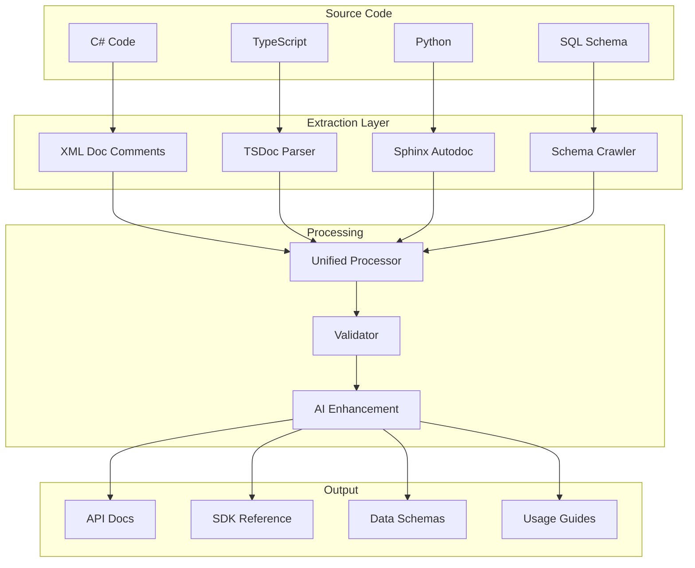

# MTGTools Documentation Automation Plan

*Version 1.0 - August 2025*
*Automating documentation to keep it accurate, current, and comprehensive*

## 🎯 Automation Vision

> "Documentation should be generated from the source of truth, not maintained separately. Every line of code should document itself."

## 🏗️ Automation Architecture



## 📋 Implementation Phases

### Phase 1: API Documentation Automation (Week 1-2)

#### 1.1 OpenAPI Generation from .NET

```csharp
// Program.cs configuration
builder.Services.AddEndpointsApiExplorer();
builder.Services.AddSwaggerGen(options =>
{
    options.SwaggerDoc("v1", new OpenApiInfo
    {
        Title = "MTGTools API",
        Version = "v1",
        Description = File.ReadAllText("api-description.md"),
        Contact = new OpenApiContact
        {
            Name = "MTGTools Team",
            Email = "api@mtgtools.com",
            Url = new Uri("https://discord.gg/mtgtools")
        }
    });
    
    // Include XML comments
    var xmlFile = $"{Assembly.GetExecutingAssembly().GetName().Name}.xml";
    var xmlPath = Path.Combine(AppContext.BaseDirectory, xmlFile);
    options.IncludeXmlComments(xmlPath);
    
    // Add examples from attributes
    options.SchemaFilter<ExampleSchemaFilter>();
    options.OperationFilter<ExampleResponseFilter>();
    
    // Security definitions
    options.AddSecurityDefinition("ApiKey", new OpenApiSecurityScheme
    {
        Description = "API Key needed to access the endpoints. X-Api-Key: {key}",
        In = ParameterLocation.Header,
        Name = "X-Api-Key",
        Type = SecuritySchemeType.ApiKey
    });
});
```

#### 1.2 Example Attributes for Rich Documentation

```csharp
/// <summary>
/// Get current metagame breakdown for the specified format
/// </summary>
/// <remarks>
/// Returns metagame distribution with archetype percentages and performance metrics.
/// Data is cached for 1 hour and refreshed after major events.
/// </remarks>
/// <param name="format">MTG format to analyze</param>
/// <param name="timeframe">Analysis timeframe (default: 7d)</param>
/// <response code="200">Metagame data retrieved successfully</response>
/// <response code="400">Invalid format specified</response>
/// <response code="429">Rate limit exceeded</response>
[HttpGet("metagame/current")]
[ProducesResponseType(typeof(MetagameResponse), 200)]
[ProducesResponseType(typeof(ErrorResponse), 400)]
[ProducesResponseType(typeof(ErrorResponse), 429)]
[SwaggerExample(typeof(MetagameResponseExample))]
public async Task<IActionResult> GetCurrentMetagame(
    [FromQuery, Required] string format,
    [FromQuery] string timeframe = "7d")
{
    // Implementation
}
```

#### 1.3 Automated OpenAPI to Documentation Pipeline

```yaml
# .github/workflows/generate-api-docs.yml
name: Generate API Documentation

on:
  push:
    paths:
      - 'src/**/*.cs'
      - 'api-description.md'
  
jobs:
  generate-docs:
    runs-on: ubuntu-latest
    
    steps:
      - uses: actions/checkout@v3
      
      - name: Setup .NET
        uses: actions/setup-dotnet@v3
        with:
          dotnet-version: '8.0.x'
      
      - name: Build with XML docs
        run: |
          dotnet build -c Release \
            -p:GenerateDocumentationFile=true \
            -p:NoWarn=CS1591
      
      - name: Run API to extract OpenAPI
        run: |
          dotnet run --project src/MTGTools.Api &
          sleep 10
          curl http://localhost:5000/swagger/v1/swagger.json > openapi.json
          kill %1
      
      - name: Validate OpenAPI spec
        run: npx @apidevtools/swagger-cli validate openapi.json
      
      - name: Generate documentation
        run: |
          # Generate interactive API docs
          npx @redocly/cli build-docs openapi.json -o dist/api-docs.html
          
          # Generate markdown for docs site
          npx widdershins openapi.json -o docs/api/reference.md \
            --language_tabs 'javascript:JavaScript' 'python:Python' 'csharp:C#' 'shell:cURL'
          
          # Generate SDK code snippets
          npx @openapitools/openapi-generator-cli generate \
            -i openapi.json \
            -g javascript \
            -o sdk/javascript \
            --additional-properties=snapshot=false
      
      - name: Deploy to docs site
        run: |
          npm run docs:build
          npm run docs:deploy
```

### Phase 2: Code Documentation Extraction (Week 2-3)

#### 2.1 TypeScript/JavaScript Documentation

```typescript
// tsconfig.json
{
  "compilerOptions": {
    "declaration": true,
    "declarationMap": true,
    "sourceMap": true,
    "plugins": [
      {
        "name": "typescript-tslint-plugin"
      }
    ]
  },
  "typedocOptions": {
    "entryPoints": ["src/index.ts"],
    "out": "docs/api/typescript",
    "plugin": ["typedoc-plugin-markdown"],
    "theme": "markdown",
    "readme": "none",
    "githubPages": false,
    "includeVersion": true,
    "categorizeByGroup": true,
    "defaultCategory": "Other",
    "categoryOrder": [
      "Core",
      "API",
      "Components",
      "Utilities",
      "*"
    ]
  }
}
```

```typescript
/**
 * Analyzes a deck list to determine its archetype
 * 
 * @category Core
 * @param deckList - Array of card names with quantities
 * @param format - MTG format for analysis
 * @returns Predicted archetype with confidence score
 * 
 * @example
 * ```typescript
 * const archetype = await analyzeDeck([
 *   "4 Lightning Bolt",
 *   "4 Monastery Swiftspear",
 *   // ... rest of deck
 * ], 'modern');
 * 
 * console.log(archetype);
 * // { name: "Burn", confidence: 0.92 }
 * ```
 * 
 * @see {@link https://docs.mtgtools.com/guides/archetype-detection}
 */
export async function analyzeDeck(
  deckList: string[],
  format: Format
): Promise<ArchetypeResult> {
  // Implementation
}
```

#### 2.2 Python Documentation Generation

```python
# conf.py for Sphinx
extensions = [
    'sphinx.ext.autodoc',
    'sphinx.ext.napoleon',
    'sphinx.ext.viewcode',
    'sphinx.ext.intersphinx',
    'sphinx_autodoc_typehints',
    'myst_parser',
    'sphinx_copybutton',
    'sphinx_design',
]

# Napoleon settings for Google style docstrings
napoleon_google_docstring = True
napoleon_numpy_docstring = False
napoleon_include_init_with_doc = True

# Autodoc settings
autodoc_default_options = {
    'members': True,
    'member-order': 'bysource',
    'special-members': '__init__',
    'undoc-members': True,
    'exclude-members': '__weakref__'
}

# Generate API docs automatically
autosummary_generate = True
```

```python
def calculate_metagame_share(
    tournament_results: List[TournamentResult],
    min_players: int = 8,
    time_window: timedelta = timedelta(days=7)
) -> Dict[str, float]:
    """Calculate metagame share percentages from tournament results.
    
    Analyzes tournament results within the specified time window to determine
    the percentage representation of each archetype in the competitive metagame.
    
    Args:
        tournament_results: List of tournament results to analyze
        min_players: Minimum tournament size to include (default: 8)
        time_window: Time period to analyze (default: 7 days)
    
    Returns:
        Dictionary mapping archetype names to their metagame percentage
    
    Example:
        >>> results = fetch_tournament_results('modern')
        >>> metagame = calculate_metagame_share(results)
        >>> print(f"Burn: {metagame['Burn']:.1f}%")
        Burn: 8.3%
    
    Note:
        Results are weighted by tournament size and recency, with larger
        and more recent tournaments having greater influence.
    
    See Also:
        :func:`fetch_tournament_results`: Get tournament data
        :func:`classify_archetype`: Identify deck archetypes
    """
    # Implementation
```

### Phase 3: Database Schema Documentation (Week 3)

#### 3.1 SQL Documentation Comments

```sql
-- migrations/001_create_tournaments.sql

/**
 * @table tournaments
 * @description Stores Magic tournament metadata and results
 * @indexes
 *   - idx_tournaments_date (event_date DESC)
 *   - idx_tournaments_format (format, event_date DESC)
 */
CREATE TABLE tournaments (
    /**
     * @column tournament_id
     * @description Unique identifier for the tournament
     * @type UUID
     * @primary_key
     */
    tournament_id UUID PRIMARY KEY DEFAULT gen_random_uuid(),
    
    /**
     * @column name
     * @description Tournament name as displayed to users
     * @type VARCHAR(255)
     * @required
     * @example "Grand Open Qualifier #3"
     */
    name VARCHAR(255) NOT NULL,
    
    /**
     * @column format
     * @description MTG format played
     * @type ENUM
     * @values modern, legacy, pioneer, standard, pauper
     * @required
     * @index
     */
    format VARCHAR(20) NOT NULL CHECK (format IN ('modern', 'legacy', 'pioneer', 'standard', 'pauper')),
    
    /**
     * @column event_date
     * @description Date when tournament was held
     * @type DATE
     * @required
     * @index DESC
     */
    event_date DATE NOT NULL,
    
    /**
     * @column players_count
     * @description Number of players who participated
     * @type INTEGER
     * @constraints >= 2
     */
    players_count INTEGER NOT NULL CHECK (players_count >= 2),
    
    /**
     * @column created_at
     * @description When this record was created
     * @type TIMESTAMPTZ
     * @default NOW()
     * @system_field
     */
    created_at TIMESTAMPTZ NOT NULL DEFAULT NOW()
);

-- @index Optimize format + date queries for metagame analysis
CREATE INDEX idx_tournaments_format_date ON tournaments(format, event_date DESC);
```

#### 3.2 Schema Documentation Generator

```yaml
# schemaspy configuration
schemaspy:
  output: ./docs/database
  database_type: pgsql
  host: localhost
  database: mtgtools
  schemas: public
  user: ${DB_USER}
  password: ${DB_PASSWORD}
  
  # Include column comments
  comments: true
  
  # Generate relationships diagram
  rails: true
  
  # Custom CSS for MTGTools branding
  css: ./docs/assets/schemaspy-custom.css
  
  # Additional metadata
  meta:
    - name: "Generated"
      content: "${timestamp}"
    - name: "Environment"
      content: "${environment}"
```

### Phase 4: Documentation Validation & Testing (Week 4)

#### 4.1 Documentation Coverage Testing

```javascript
// docs-coverage.test.js
const glob = require('glob');
const fs = require('fs');
const path = require('path');

describe('Documentation Coverage', () => {
  test('All API endpoints have documentation', async () => {
    const endpoints = await extractEndpoints('./src/api');
    const documented = await extractDocumentedEndpoints('./docs/api');
    
    const undocumented = endpoints.filter(e => !documented.includes(e));
    
    expect(undocumented).toEqual([]);
  });
  
  test('All public functions have examples', async () => {
    const functions = await extractPublicFunctions('./src');
    
    for (const func of functions) {
      const hasExample = await checkForExample(func);
      expect(hasExample).toBe(true);
    }
  });
  
  test('All database tables have descriptions', async () => {
    const tables = await extractTables('./migrations');
    
    for (const table of tables) {
      const hasDescription = await checkTableDescription(table);
      expect(hasDescription).toBe(true);
    }
  });
});
```

#### 4.2 Documentation Link Checker

```yaml
# .github/workflows/check-docs.yml
name: Documentation Quality Checks

on:
  pull_request:
    paths:
      - 'docs/**'
      - '**/*.md'

jobs:
  check-links:
    runs-on: ubuntu-latest
    steps:
      - uses: actions/checkout@v3
      
      - name: Check markdown links
        uses: gaurav-nelson/github-action-markdown-link-check@v1
        with:
          use-quiet-mode: 'yes'
          config-file: '.markdown-link-check.json'
      
      - name: Check code examples
        run: |
          # Extract and test all code blocks
          npm run docs:test-examples
      
      - name: Validate API examples
        run: |
          # Test all API examples against actual API
          npm run docs:validate-api-examples
      
      - name: Check documentation coverage
        run: |
          npm run docs:coverage
          
          # Fail if coverage drops below 80%
          coverage=$(cat docs-coverage.json | jq '.percentage')
          if (( $(echo "$coverage < 80" | bc -l) )); then
            echo "Documentation coverage too low: $coverage%"
            exit 1
          fi
```

### Phase 5: AI-Enhanced Documentation (Ongoing)

#### 5.1 Documentation AI Assistant

```python
# docs_enhancer.py
import openai
from typing import Dict, List

class DocumentationEnhancer:
    """
    Uses AI to improve documentation quality and consistency
    """
    
    def enhance_function_doc(self, code: str, existing_doc: str) -> str:
        """
        Enhance function documentation with AI suggestions
        """
        prompt = f"""
        Given this function and its current documentation, suggest improvements:
        
        Code:
        {code}
        
        Current Documentation:
        {existing_doc}
        
        Please improve the documentation by:
        1. Adding missing parameter descriptions
        2. Providing a clear example
        3. Noting any edge cases
        4. Adding "See Also" references if applicable
        
        Keep the same documentation format and style.
        """
        
        response = openai.ChatCompletion.create(
            model="gpt-4",
            messages=[{"role": "user", "content": prompt}],
            temperature=0.3
        )
        
        return response.choices[0].message.content
    
    def generate_tutorial_outline(self, api_endpoints: List[str]) -> str:
        """
        Generate tutorial outline based on API endpoints
        """
        # AI generates step-by-step tutorial structure
        pass
    
    def check_documentation_clarity(self, doc: str) -> Dict[str, any]:
        """
        Analyze documentation for clarity and completeness
        """
        # Returns clarity score and suggestions
        pass
```

## 📊 Documentation Metrics & Monitoring

### Key Metrics to Track

```javascript
// documentation-analytics.js
const analytics = {
  // Coverage metrics
  apiEndpointsCovered: 45,
  apiEndpointsTotal: 47,
  coveragePercentage: 95.7,
  
  // Quality metrics
  averageExamplesPerEndpoint: 2.3,
  brokenLinksCount: 0,
  outdatedSections: 3,
  
  // Usage metrics
  pageViews: {
    '/docs/quickstart': 1847,
    '/docs/api/reference': 923,
    '/docs/tutorials/first-app': 654
  },
  
  // Search metrics
  topSearchTerms: [
    'authentication',
    'rate limits',
    'metagame endpoint',
    'websocket'
  ],
  
  searchSuccessRate: 0.82
};

// Send to monitoring dashboard
sendToDatadog('docs.metrics', analytics);
```

### Documentation Health Dashboard

```yaml
# docs-health.yml
metrics:
  - name: Documentation Coverage
    query: count(documented_endpoints) / count(total_endpoints) * 100
    threshold: 90
    alert: below
    
  - name: Example Coverage
    query: count(endpoints_with_examples) / count(documented_endpoints) * 100
    threshold: 80
    alert: below
    
  - name: Broken Links
    query: count(broken_links)
    threshold: 0
    alert: above
    
  - name: Days Since Last Update
    query: max(days_since_update by section)
    threshold: 30
    alert: above
```

## 🚀 Implementation Timeline

### Week 1-2: Foundation
- [ ] Set up OpenAPI generation pipeline
- [ ] Configure TypeDoc for TypeScript
- [ ] Create first automated API docs
- [ ] Deploy to docs.mtgtools.com

### Week 3-4: Expansion
- [ ] Add Python documentation pipeline
- [ ] Implement database schema docs
- [ ] Create documentation testing
- [ ] Set up link checking

### Month 2: Enhancement
- [ ] Integrate AI enhancement
- [ ] Add interactive examples
- [ ] Implement search
- [ ] Create metrics dashboard

### Month 3: Optimization
- [ ] Multi-language support
- [ ] Version management
- [ ] Advanced tutorials
- [ ] Community contributions

## ✅ Success Criteria

Documentation automation is successful when:

1. **Coverage**: 95%+ of public APIs documented automatically
2. **Accuracy**: Zero manual documentation updates needed
3. **Freshness**: Docs update within 5 minutes of code changes
4. **Quality**: 90%+ have working examples
5. **Discovery**: 80%+ find what they need via search
6. **Maintenance**: < 2 hours/week on documentation

---

*"The best documentation is the one that writes itself."*