# Videre Project — Architecture (Corrected)

```mermaid
graph TD
  A["MTGO Client (Windows)"] --> B["MTGOSDK (C#/.NET)\nMemory reader + event extractor"]
  B <-->|"JSON-RPC IPC"| C["Tracker (C# overlay)\nIn-game UI + telemetry"]

  G["mtgo-db (Postgres)\nCentral database"]
  E["Public API (Cloudflare Workers)\nMetaAPI endpoints"]
  F["asi-worker (Python on Workers/CF)\nArchetype Similarity Index"]
  J["MTGOBot (C#)"]
  H["Analytics/Visualization\nObservable notebook / Website"]

  %% Data flows
  F <--> G
  J <--> G
  G --> E
  E --> H

  subgraph Videre Project Repos
    B
    C
    F
    G
    E
    J
  end

  style A fill:#111,stroke:#999
  style B fill:#1f2937,stroke:#f59e0b
  style C fill:#1f2937,stroke:#f59e0b
  style E fill:#0b1220,stroke:#22d3ee
  style F fill:#0b1220,stroke:#22d3ee
  style G fill:#0b1220,stroke:#22d3ee
  style H fill:#0b1220,stroke:#84cc16
  style J fill:#0b1220,stroke:#a78bfa
```

Notes
- MTGOSDK communicates with Tracker via JSON‑RPC (IPC stream).
- `asi-worker` and `MTGOBot` read/write the central Postgres (`mtgo-db`).
- Observable/website consume public endpoints on Cloudflare Workers that read from Postgres.
